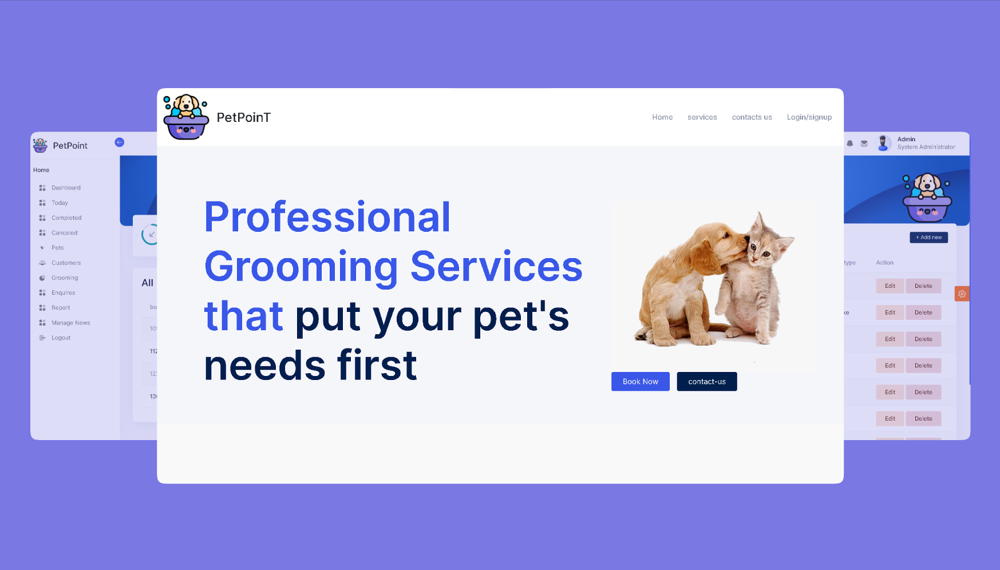

# Pet Grooming Service Booking

Pet Grooming Service Booking is a web application built with ASP.NET and utilizes Microsoft SQL for the backend. This application provides a comprehensive platform for managing pet grooming services, designed to be user-friendly for both administrators and customers.

## Languages and Tools

## Features

- **Admin Side:**
  - Full control over the web application.
  - Create and manage customer accounts.
  - Add pets to each customer account.
  - Schedule grooming sessions for different types of pets.
  - Add new pet types.
  - Handle complaints, inquiries, and requests.

- **Customer Side:**
  - Create a personal account.
  - Add pets to the account.
  - Book grooming sessions for pets.
  - Submit complaints, inquiries, and requests.

## Screenshots

## Getting Started

### Prerequisites

- ASP.NET development environment.
- Microsoft SQL Server.

## Usage

### Admin Side

1. Log in to the admin portal.
2. Create new customer accounts.
3. Add pets to customer accounts.
4. Schedule grooming sessions for different pet types.
5. Manage complaints, inquiries, and requests.

### Customer Side

1. Sign up for a customer account.
2. Add pets to your account.
3. Book grooming sessions for your pets.
4. Submit complaints, inquiries, and requests.

## Database Schema

For details on the database schema, refer to [Database Schema](/database-schema.md).

## License

This project is licensed under the Ashish Jacob Benson - see the [LICENSE](LICENSE) file for details.

## Contact Information

- gmail(ashishjbenson@gmail.com)
